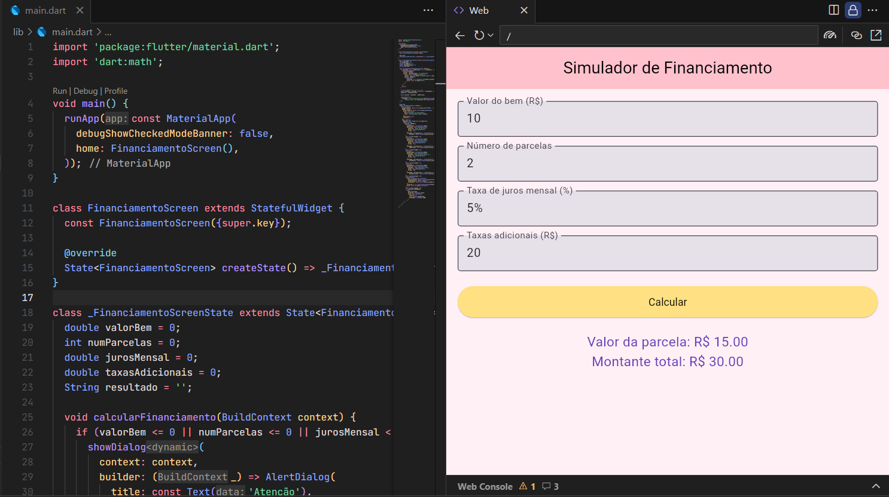

# Financiamento

# Simulador de Financiamento com Juros Compostos
Aplicativo Flutter que simula o valor das parcelas e o custo total de um financiamento com base no valor do bem, número de parcelas, taxa de juros mensal e taxas adicionais.

## Objetivo
Auxiliar usuários a tomarem decisões financeiras mais conscientes ao prever o impacto dos juros compostos antes de financiar um bem (como carro, imóvel ou eletrodoméstico).

## Fórmula Utilizada
Montante total:  
M = C × (1 + i)^t + taxas

## Tecnologias
- Flutter 
- Dart 
- Vs Code
- Fire Base 

## Print da Tela

##  Como Executar
1° Abra o Firebase Studio  
2° Selecione a opção Flutter  
3° Crie uma pasta com o nome do projeto  
4° Procure na pasta _lib_ o arquivo *main.dart*  
5° Adicione a sua programação e observe o resultado na tela Web ou Android

